# Дипломная работа по профессии «Системный администратор» - Липин Роман

Задание по дипломной работе - https://github.com/netology-code/sys-diplom/tree/diplom-zabbix

Подготовка рабочего места оператора описана в отдельном документе - [operator.md](<operator.md>)

## Оглавление

* [Инфраструктура](#Инфраструктура)
* [Сайт](#Сайт)
* [Мониторинг](#Мониторинг)
* [Логи](#Логи)
* [Сеть](#Сеть)
* [Резервное копирование](#Резервное-копирование)

## Инфраструктура

Для автоматического развертывания инфраструктуры использовался terraform, в конфигурации виртуальных машин подключался файл cloud-init ([metadata.yaml](metadata.yaml)) с помощью которого создавался пользователь для удаленного доступа по SSH. С документацией по работе с cloud-init можно ознакомиться на сайте [cloudinit.readthedocs.io](<https://cloudinit.readthedocs.io/en/latest/>).

Для доступа к серверам и проверки дипломной работы был сгенерирован дополнительный ([ssh ключ](.ssh/diplom))

Подключение через джамп сервер:

~~~ bash
ssh -i ~/.ssh/diplom -J user@51.250.45.0 user@local_hostname
~~~

Для удобства чтения конфигурация terraform разделена на несколько файлов:
- [main.tf](main.tf) - основной файл конфигурации
- [outputs.tf](outputs.tf) - файл выходных значений
- [variables.tf](variables.tf) - файл переменных
- [vm.tf](vm.tf) - файл конфигурации виртуальных машин

Адреса развернутых серверов:

|Сервис|FQDN имя|Внутренний IP адрес|Внешний адрес|
|---|---|---|---|
|nginx|nginx-1.ru-central1.internal|192.168.10.32|-|
|nginx|nginx-2.ru-central1.internal|192.168.20.34|-|
|elasticsearch|elastic.ru-central1.internal|192.168.30.29|-|
|kibana|kebana.ru-central1.internal|192.168.40.4|51.250.43.240:5601|
|zabbix|zabbix.ru-central1.internal|192.168.40.26|51.250.36.235:80|
|bastion|bastion.ru-central1.internal|192.168.40.16|51.250.45.0:22|
|load balancer|-|-|158.160.107.117:80|

Для работы с ansible динамически формируются файл конфигурации и файл hosts, используется механизм выходных значений [output values](<https://developer.hashicorp.com/terraform/language/values/outputs>).

## Сайт

Было развернуто 6 виртуальных машин, из них 2 веб сервера в разных зонах:

Создана целевая группа:

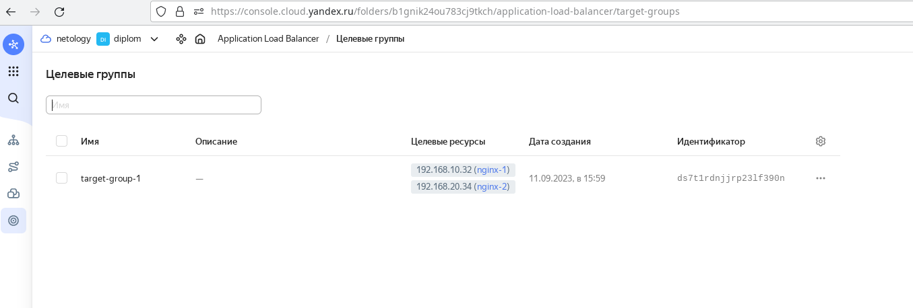

Создана группа бэкендов:

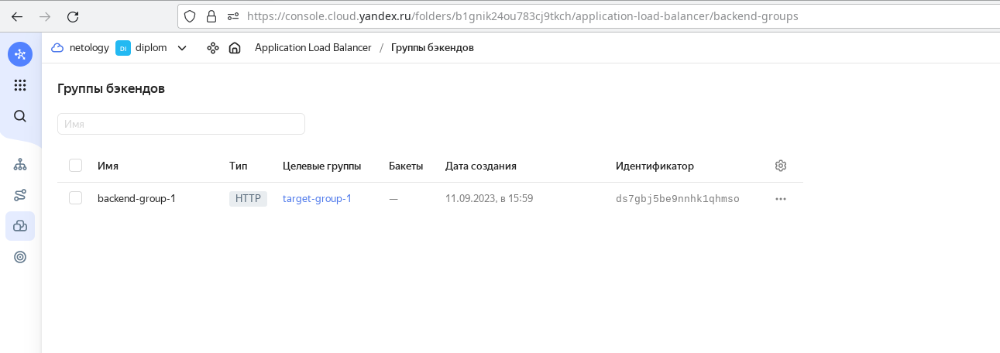

Создан HTTP роутер:

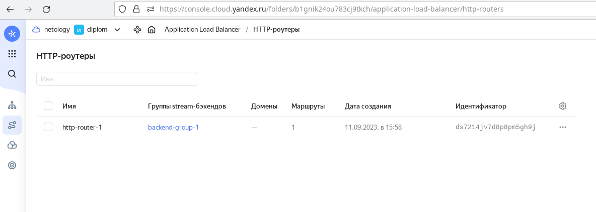

Создан балансировщик:

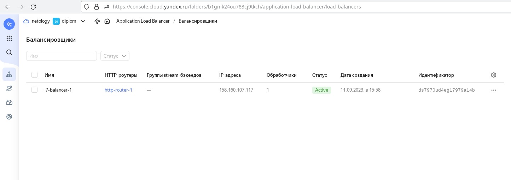

Проведено тестирование балансировщика:

~~~ bash
curl -v 158.160.35.166:80
~~~

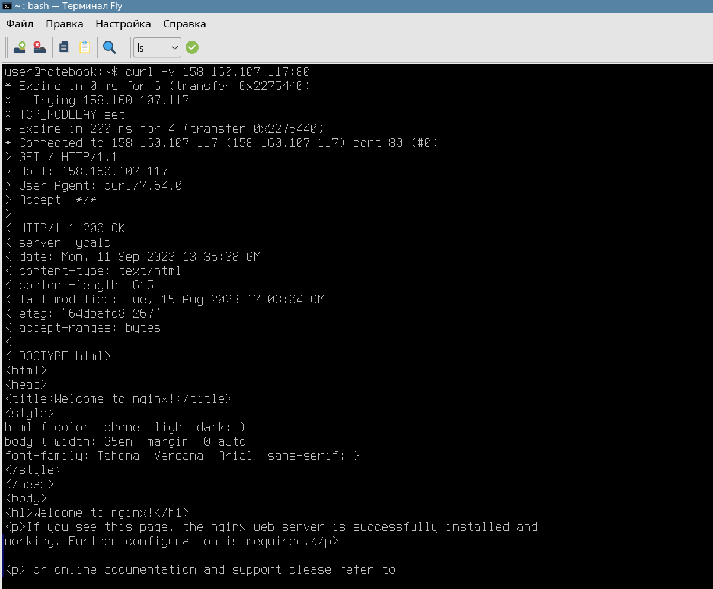

## Мониторинг

Развернутая виртуальная машина с zabbix доступна по адресу http://51.250.36.235/

Логин: Admin

Пароль zabbix

Проведена настройка панелей:

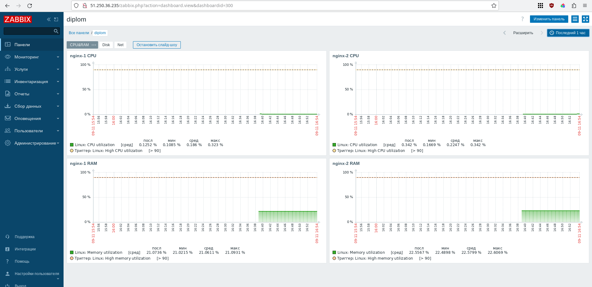

## Логи

Развернутая виртуальная машина с kibana доступна по адресу http://51.250.43.240:5601

Проведена настройка отправки логов:

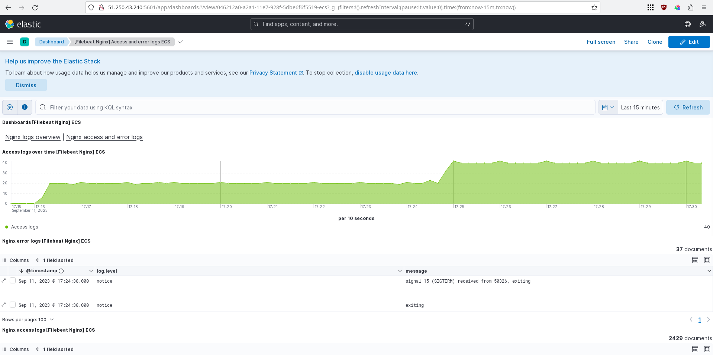

## Сеть

Создана сеть:

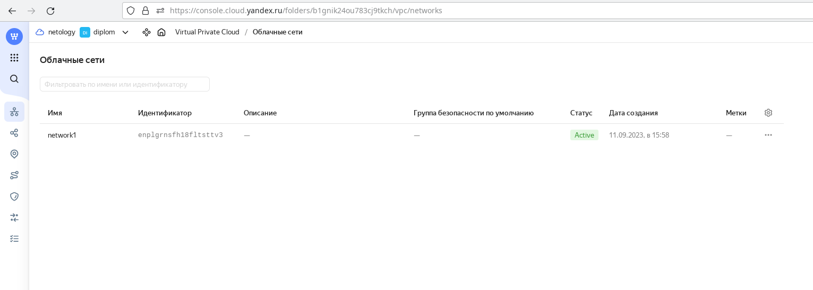

Созданы подсети:

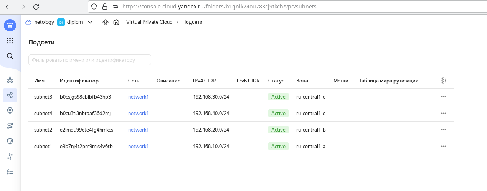

Созданы группы безопасности:

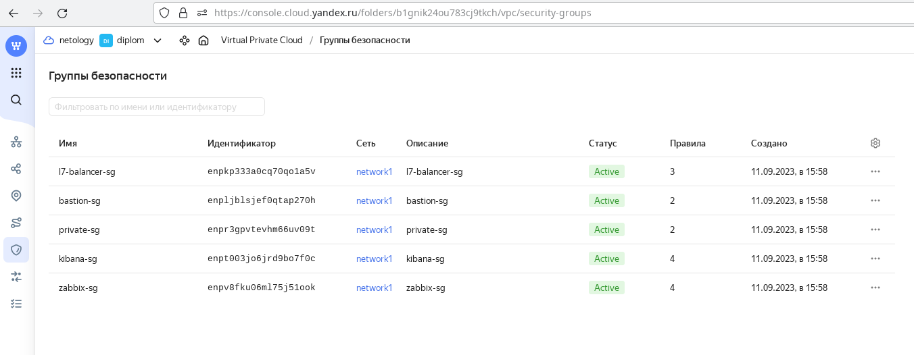

## Резервное копирование

Созданы снимки дисков:

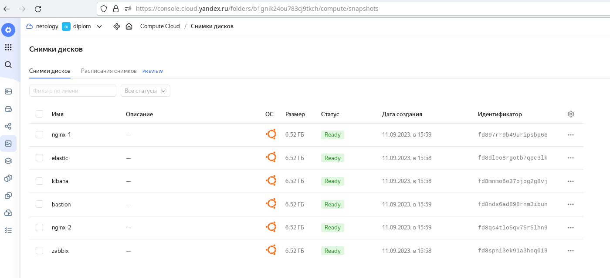

Создано расписание снимков:

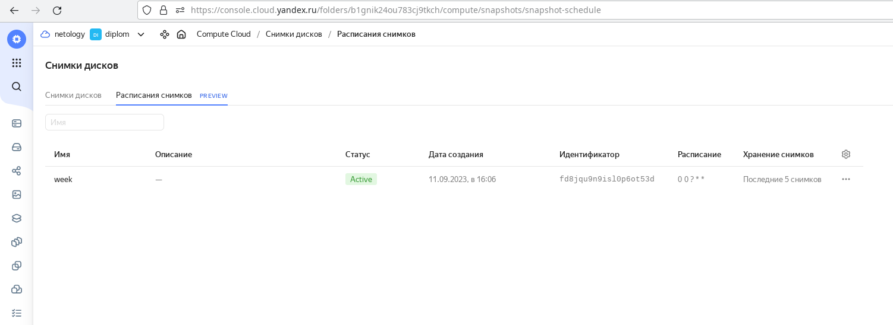

Раснисание было настроено на 5 дней, т.к. развернуто 6 вирутальных машин, а имеющиеся квоты ограничены 32 дисками:

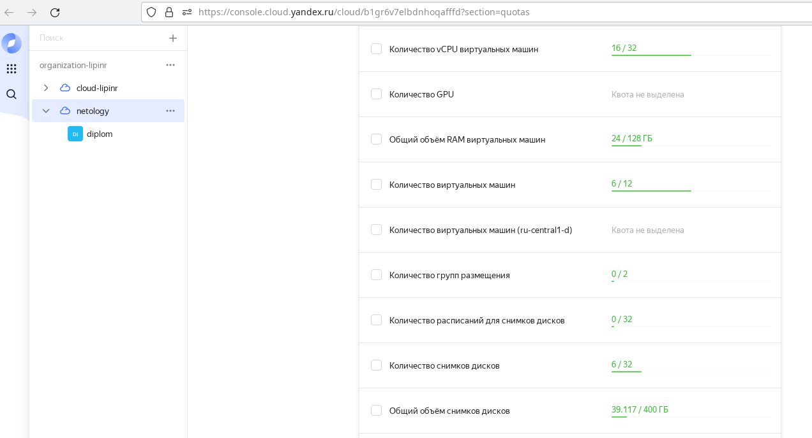
